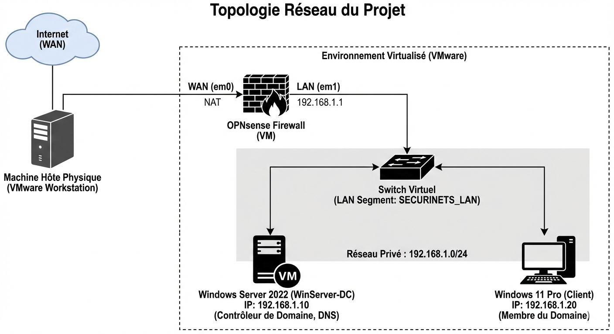
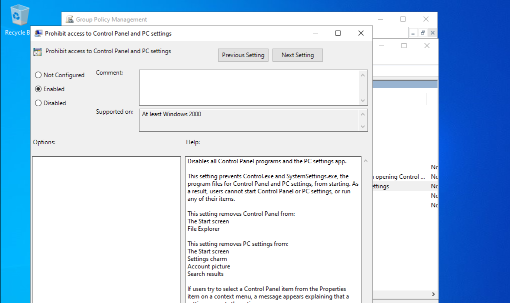

# 🛡️ Mise en place d'une Infrastructure Active Directory Sécurisée

## 📋 Présentation du Projet
Ce projet, réalisé dans le cadre du module **Securinets**, vise à déployer une infrastructure réseau d'entreprise complète et sécurisée dans un environnement virtualisé.

Il simule un réseau réel comprenant :
- Un pare-feu périmétrique (**OPNsense**)
- Un Contrôleur de Domaine (**Active Directory**)
- Des postes clients administrés (**Windows 11**)
- Une segmentation réseau stricte (**LAN Segments**)

## 👥 L'Équipe
* **Louay Njah**
* **Maram Souidi**
* **Bader Hamdi**
* **Omar Karoui**
* **Safia Nasr**

---

## 🏗️ Architecture Réseau (Phase 1)

L'infrastructure repose sur une isolation stricte entre le réseau public (Internet) et le réseau privé de l'entreprise via VMware LAN Segments.

### Composants :
* **OPNsense (Firewall) :**
    * WAN : NAT (Accès Internet)
    * LAN : `192.168.1.1` (Passerelle par défaut)
* **Segment Privé :** `SECURINETS_LAN` (Totalement isolé de l'hôte)

---

## 🔐 Active Directory & Services (Phase 2)

Le cœur du réseau est géré par Windows Server 2022.

### Configuration du Contrôleur de Domaine (DC)
* **Domaine :** `securinetsenit.local`
* **Serveur :** `WinServer-DC` (`192.168.1.10`)
* **Structure Organisationnelle (OU) :**
    * Création d'une hiérarchie personnalisée (`_USERS`, `_COMPUTERS`) pour éviter les conteneurs par défaut.
    * Départements : *IT, Finance, Marketing*.

### Sécurité & GPO
Mise en place de stratégies de groupe pour sécuriser les postes clients :
* ✅ Jonction au domaine des postes Windows 11.
* ✅ **GPO "Restrict Control Panel" :** Interdiction d'accès aux paramètres pour les utilisateurs standard.

*(L'utilisateur Sami IT ne peut pas accéder aux paramètres)*

---

## 🚀 Installation & Reproduction

Pour reproduire ce labo, vous avez besoin de :
1.  **VMware Workstation** (ou VirtualBox).
2.  ISO **Windows Server 2022**.
3.  ISO **Windows 11 Pro** (Version Pro obligatoire pour le domaine).
4.  Image **OPNsense**.

### Étapes clés :
1.  Créer le segment LAN dans VMware.
2.  Installer OPNsense et configurer le LAN en `192.168.1.1`.
3.  Installer Windows Server, fixer l'IP en `192.168.1.10` et installer le rôle AD DS.
4.  Promouvoir le serveur (dcpromo) en nouveau domaine.
5.  Joindre le client Windows 11 au domaine (DNS = `192.168.1.10`).

---

## 📄 Rapport Complet
Pour tous les détails techniques, captures d'écrans pas à pas et explications théoriques, consultez le rapport complet :
👉 **[Télécharger le Rapport PDF](Securinets1.pdf)**
