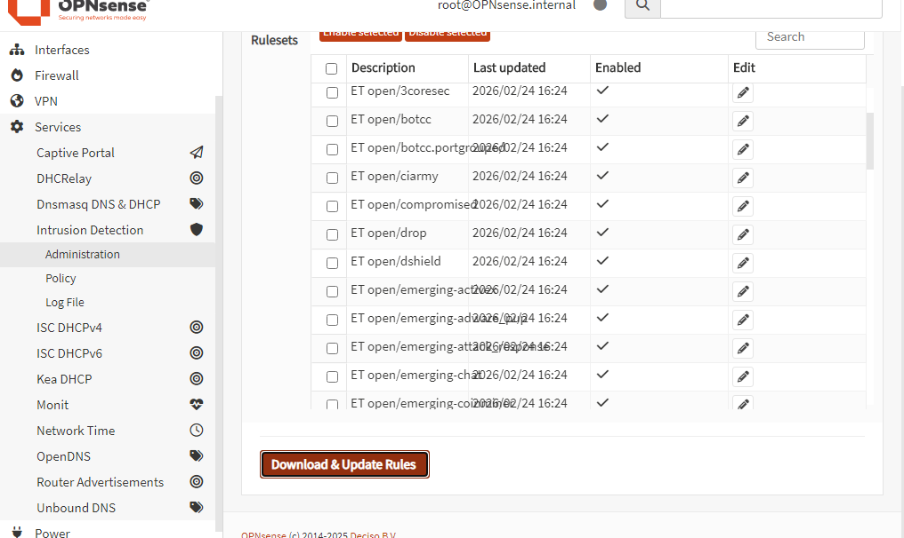
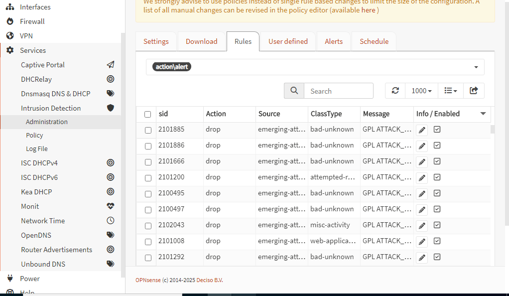
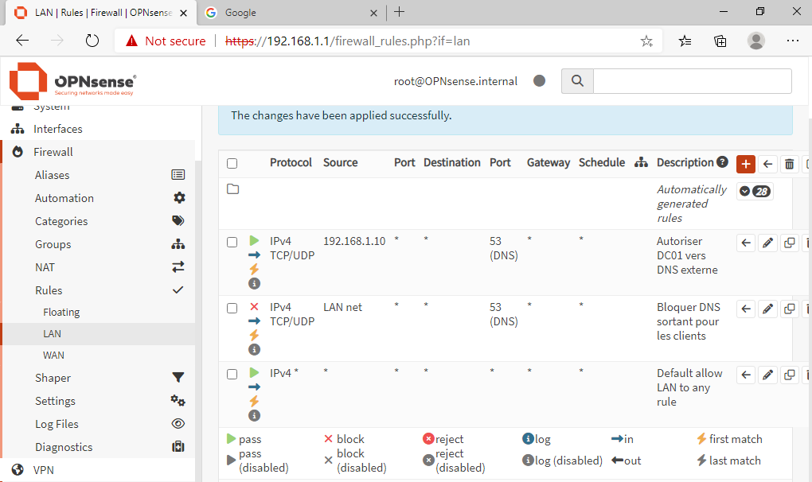
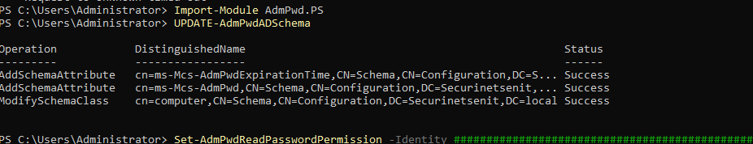
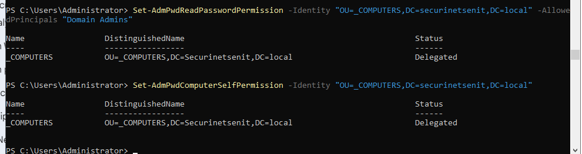
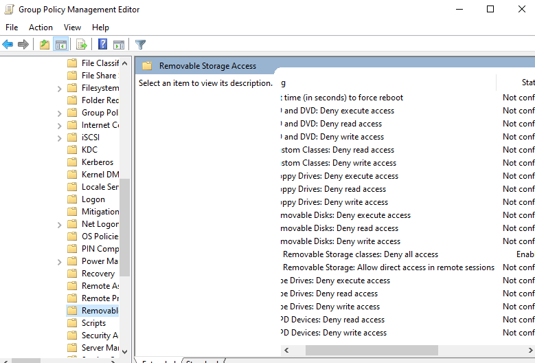
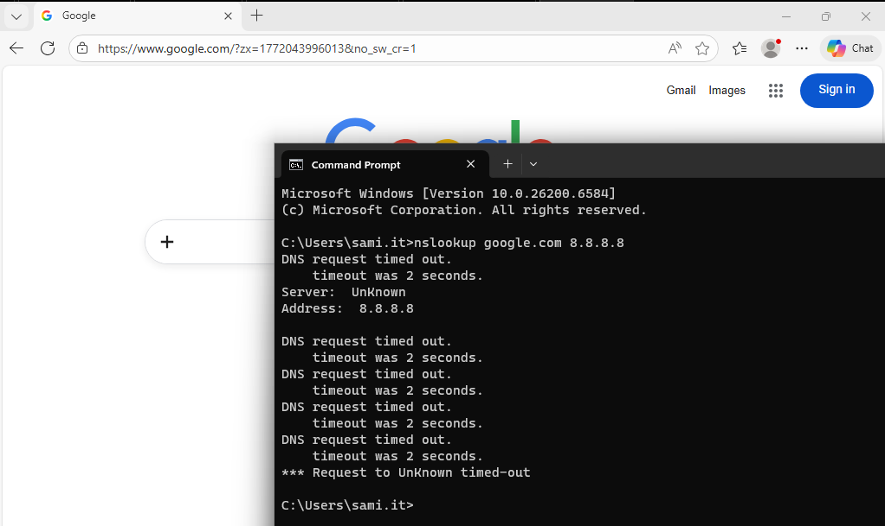
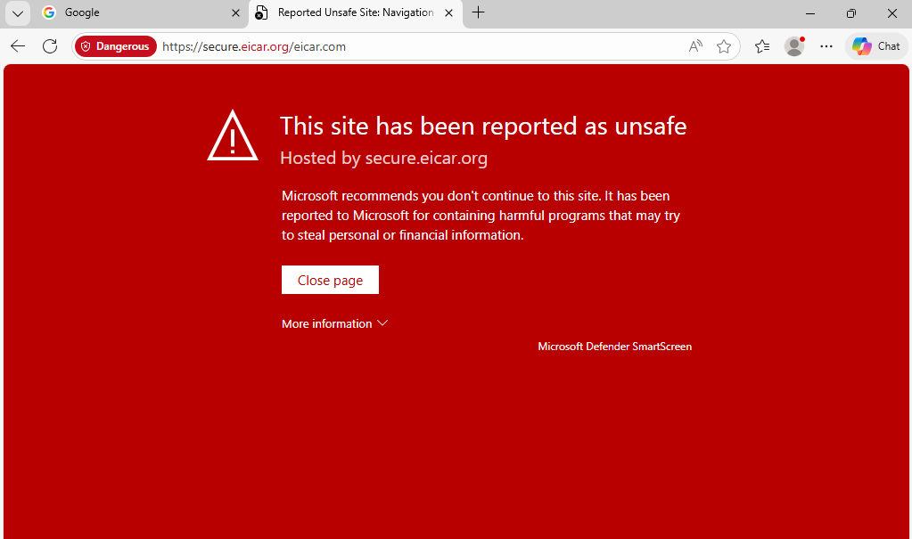
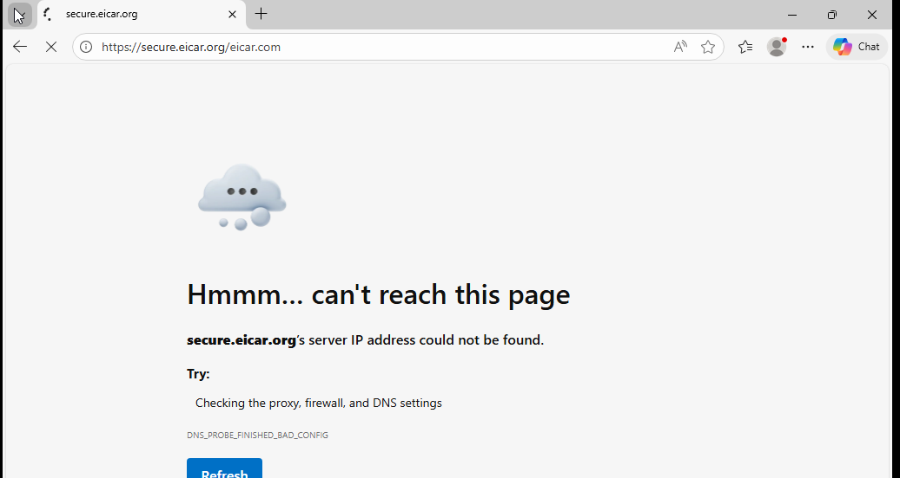

# Rapport de Projet - Phase 3 : Défense Périmétrique, Durcissement (Hardening) et Tests d'Intrusion

## 1. Objectif de la Phase 3
Suite à la mise en place de l'infrastructure réseau (VMware, OPNsense) et au déploiement de l'Active Directory (Phases 1 et 2), l'objectif de cette troisième phase est d'appliquer le principe de **Défense en Profondeur** (Defense in Depth). Il s'agit de sécuriser le périmètre réseau contre les menaces externes, de durcir les configurations des postes clients, et de valider ces défenses par des simulations d'attaques.

---

## 2. Glossaire et Nouveaux Termes Techniques
* **IDS / IPS (Intrusion Detection/Prevention System) :** Analyse le contenu des paquets réseau (Deep Packet Inspection - couche 7) pour détecter et bloquer des signatures d'attaques connues (malwares, failles).
* **Suricata :** Le moteur IDS/IPS open-source haute performance intégré nativement dans OPNsense.
* **LAPS (Local Administrator Password Solution) :** Outil Microsoft qui génère un mot de passe aléatoire et unique pour le compte Administrateur local de chaque machine, empêchant les attaques par mouvement latéral (Pass-the-Hash).
* **Zero Trust / Egress Filtering :** Le principe de ne faire confiance à aucun trafic, même sortant. Le trafic LAN vers WAN est bloqué par défaut, et seules les communications strictement nécessaires sont autorisées via listes blanches.
* **Event ID 4625 :** L'identifiant généré par l'observateur d'événements Windows lorsqu'une tentative de connexion échoue.

---

## 3. Détail des Opérations Réalisées

### Étape 1 : Déploiement et Configuration de l'IPS (Suricata sur OPNsense)
Pour protéger le réseau contre les menaces avancées, le module de détection d'intrusion a été configuré pour bloquer activement les attaques.

1. **Activation du service (Services > Intrusion Detection > Administration) :**
   * Activation des options : `Enabled`, `IPS mode` (pour bloquer et non juste alerter), `Promiscuous mode` et `Enable syslog alerts`.
   * Interfaces sélectionnées : `LAN` et `WAN`.
2. **Téléchargement des règles (Onglet Download) :**
   * Sélection et activation des listes de règles gratuites **ET telemetry** et **ET open**.
   
   

3. **Mise en place de la politique de blocage (Onglet Rules) :**
   * Filtrage des règles ayant l'action par défaut "Alert".
   * Modification de leur comportement pour forcer l'action **"Drop"** (Bloquer).
   
   

### Étape 2 : Filtrage Réseau Strict (Egress Filtering DNS sur OPNsense)
Afin d'empêcher les exfiltrations de données via des requêtes DNS illégitimes, les clients ont été forcés d'utiliser uniquement le Contrôleur de Domaine (DC01). 
L'ordre des règles (Top-Down) a été rigoureusement configuré sous **Firewall > Rules > LAN** :

* **Règle 1 (Liste blanche du Serveur) :** `Action: Pass` | `Source: 192.168.1.10` | `Port: 53 (DNS)`
* **Règle 2 (Blocage du reste du LAN) :** `Action: Block` | `Source: LAN net` | `Port: 53 (DNS)`
* **Règle 3 (Autorisation Web standard) :** `Action: Pass` | `Source: LAN net` | `Port: Any`

### Étape 3 : Hardening de l'Active Directory (LAPS et GPO USB)
Pour sécuriser les postes clients (`WS01`), deux mesures de durcissement ont été appliquées directement sur le serveur `DC01`.

**A. Déploiement de Microsoft LAPS :**
Après l'installation du package MSI, le schéma Active Directory a été préparé via PowerShell pour l'OU spécifique de notre infrastructure :

Les permissions ont ensuite été accordées aux administrateurs du domaine et aux ordinateurs :

**B. Restriction Matérielle (Blocage USB) :**
1. Création de la stratégie `GPO_Security_BlockUSB` liée à l'Unité Organisationnelle **`_COMPUTERS`**.
2. Activation de l'option : **Toutes les classes de stockage amovible : refuser tous les accès**.

---

## 4. Phase de Validation (Pentests Internes)

Pour valider l'architecture, plusieurs simulations d'attaques ont été menées depuis la machine cliente isolée (`WS01`).

### Test 1 : Validation du filtrage Egress (DNS)
* **Action :** Tentative de contournement du serveur DNS local en forgeant une requête directement vers les serveurs de Google (8.8.8.8) via la commande `nslookup`.
* **Résultat :** Les requêtes ont été interceptées et bloquées par OPNsense (Délai d'attente dépassé), prouvant l'efficacité de la règle de blocage.

### Test 2 : Simulation de compromission par malware (Validation IPS)
* **Action :** Tentative de téléchargement du fichier de test standard EICAR via l'URL `http://secure.eicar.org/eicar.com` depuis le navigateur du client.
* **Résultat :** Connexion réinitialisée immédiatement ou bloquée par les solutions de sécurité (Suricata / Microsoft Defender SmartScreen).

*(Note : Selon le vecteur, la connexion brute peut également être affichée comme impossible à atteindre suite au 'Drop' réseau.)*

### Test 3 : Simulation d'attaque par Force Brute (Validation Active Directory)
* **Action :** Soumission répétée de mots de passe erronés sur le compte utilisateur `Sami IT` depuis l'écran de connexion de `WS01`.
* **Preuve :** L'Observateur d'événements de `DC01` (Journal de Sécurité) remonte les tentatives d'intrusion via **l'Event ID 4625** (Échec de l'audit).
